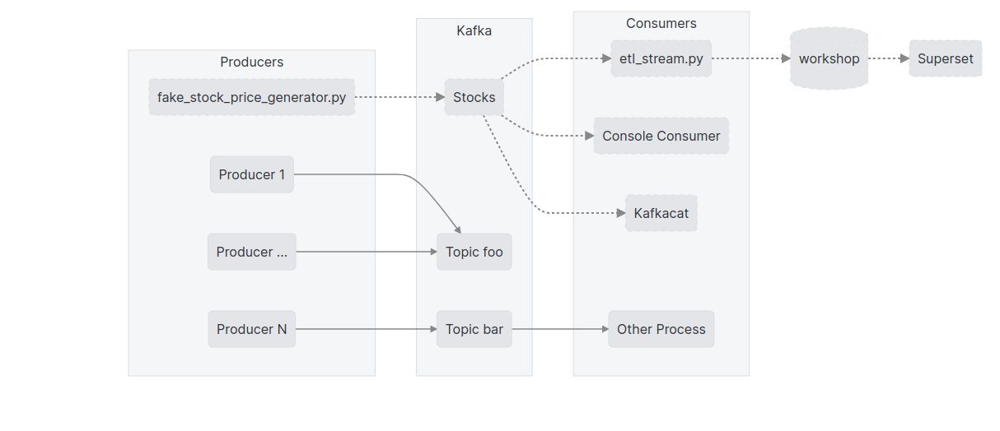

# ETL: US stocks analysis (BATCH)

## How to run our app

```bash
# Levantando docker en modo interactivo, conectando al master
docker exec -it master bash

# voy a la carpeta base de mi codigo
cd /app/python/us-stock-analysis

# Envía el job para ser ejecutado
spark-submit \
  --master 'spark://master:7077' \
  --total-executor-cores 1 \
  --executor-memory 512m \
  --driver-memory 512m \
  --jars /app/postgresql-42.1.4.jar \
  /app/python/us-stock-analysis/src/batch/etl_steps.py \
  /dataset/stocks-small \
  /dataset/yahoo-symbols-201709.csv \
  /dataset/output.parquet

# Console
pyspark \
  --master 'spark://master:7077' \
  --executor-memory 512m \
  --driver-memory 512m \
  --total-executor-cores 1 \
  --jars /app/postgresql-42.1.4.jar
```

## More examples

```bash
docker exec -it worker1 /opt/spark/bin/spark-submit \
  --master 'spark://master:7077' \
  --packages org.apache.spark:spark-sql-kafka-0-10_2.11:2.4.5 \
  --jars /app/postgresql-42.1.4.jar \
  --total-executor-cores 1 \
  /app/python/us-stock-analysis/src/examples/first_example.py

docker exec -it worker1 /opt/spark/bin/spark-submit \
  --master 'spark://master:7077' \
  --packages org.apache.spark:spark-sql-kafka-0-10_2.11:2.4.5 \
  --jars /app/postgresql-42.1.4.jar \
  --total-executor-cores 1 \
  src/examples/postgres_example.py
```
# Create a Project using `venv`

```bash
mkdir project1
cd project1

# Create virtualenv
python3 -m venv venv
source venv/bin/activate

# Upgrade pip & Install deps
pip install --upgrade pip
pip install -r requirements.txt

charm .
```

# ETL: US stocks analysis (STREAMING)

En el siguiente diagrama podemos ver los distintos componentes con los que vamos a interactuar en la siguiente sección.  




### Comenzar fake generator
Lo primero que haremos sera generar una serie de eventos fake que estaremos publicando en Kafka.

```bash
docker exec -it worker1 \
  python /app/python/us-stock-analysis/src/stream/fake_stock_price_generator.py \
  kafka:9092 stocks 2017-11-11T10:00:00Z

# apretar CTRL+C para salir
```

### Chequear el contenido de Kafka
Vamos a contrastar que los datos generados por el faker estén llegando efectivamente a Kafka.  

```bash
docker exec -it kafka \
  /opt/kafka_2.11-0.10.1.0/bin/kafka-console-consumer.sh \
  --bootstrap-server kafka:9092 --topic stocks --from-beginning

# apretar CTRL+C para salir
```

A continuación, para repasar  los conceptos de `logs`, donde cada evento tiene asociado un número único secuencial, consumiremos nuevamente el tópico de stocks, pero brindando información adicional a cada evento.  
Para esto haremos uso de la aplicación [kafkacat](https://docs.confluent.io/platform/current/app-development/kafkacat-usage.html).

```bash
# Parametros:
# - vamos a conectarnos al broker (-b) kafka:9092 
# - vamos a consumir (-C) el topico (-t) stocks 
# - vamos a printar los mensajes con un determinado formato (-f)

docker run --rm --network=wksp_default edenhill/kafkacat:1.6.0 -q \
    -b kafka:9092 \
    -C -t stocks -p0 \
    -f 'Partition: %p | Offset: %o | Timestamp: %T | Value: %s\n' 

# apretar CTRL+C para salir
```

Como se puede ver, cada evento tiene asociado un número secuencial único (offset) el cual se genera cuando se inserta el evento en el tópico, de ahí que el `Timestamp` (processing time) va aumentando en conjunto.  

Podemos consultar una posición cualquiera del log agregando las opciones `-oN` de offset(`-o`), donde `N` es el número secuencial que queremos consultar y `-c1`, para consumir (`-c`) un único (`1`) mensaje.

- ¿Cual fue el primer evento publicado?
- ¿El décimo?
- ¿Los últimos cinco?
- Consumamos los 20 primeros eventos de un `symbol` cualquiera (podemos usar `grep` + `head -n20`), ¿se observa alguna discrepancia entre el `Offset` o `Timestamp`* (processing time) y el valor `.timestamp` del `Value` (event time)?

*_Pueden ver la fecha correspondiente con el comando `date -d @VALUE`, dividiendo `VALUE` por `1000` (o poniendo un punto en los últimos 3 dígitos)._

### Procesamiento usando Spark Structured Streaming
[Structured Streaming + Kafka Integration Guide](https://spark.apache.org/docs/latest/structured-streaming-kafka-integration.html#deploying)

#### Estructura de una conuslta Spark Structured Streaming

Paso 1: Definir el input

En una consola levantada con `docker exec -it worker1`, ejecutamos el siguiente comando que va a ser el input de nuestro job:
```bash
sudo apt update
sudo apt install -y ncat
ncat -lk 9999
```

En otra consola (tambien levantada como la anterior), iniciamos una sesión de Spark interactiva.
```bash
pyspark --total-executor-cores 1 --executor-memory 512m --driver-memory 512m
```

```python
import pyspark.sql.functions as F

lines = (
    spark.readStream.format("socket")
    .option("host", "localhost")
    .option("port", 9999)
    .load()
)
```

Paso 2: Realizar las transformaciones

```python
words = lines.select(F.explode(F.split(F.col("value"), "\\s")).alias("word"))
counts = words.groupBy("word").count()
```

Paso 3: Definir el output sink y el modo (update, complete, append)

```python
writer = counts.writeStream.format("console").outputMode("complete")
```

Paso 4: Especificar la configuración de procesamiento (checkpoint y trigger)

```python
checkpoint_dir = "/tmp/streaming-exmaple"
writer = (
    writer
    .trigger(processingTime="1 second")
    .option("checkpointLocation", checkpoint_dir)
)
```

Paso 5: Ejecutar la consulta

```python
query = writer.start()
query.awaitTermination()
# escribir en la otra consola
# CTRL + C para pausar
query.stop()

writer = (
    counts.writeStream.format("console").outputMode("update")
    .trigger(processingTime="1 second")
    .option("checkpointLocation", checkpoint_dir)
)

query = writer.start()
query.awaitTermination()
# CTRL + C para pausar
# escribir en la otra consola
query.stop()
```

En este punto deberian escribir oraciones en la 1ra consola y el conteo de las mismas deberia aparecer en la 2da.

#### US stocks

Ya comprobado que tenemos datos en Kafka, pasaremos a procesar los mismos haciendo uso de Spark Structured Streaming.

Vamos a trabajar con los siguientes escenarios:
1. Procesar y persistir los resultados en archivos parquet particionados 
    - `query1` -> `Parquet Output`
2. Procesar y visualizar los resultados en consola
    - `query2` -> `Console Output`
3. Procesar y persistir los resultados en postgres
    - `query3` -> `Postgres Output | Simple insert`
    - `query4` -> `Postgres Output | Average Price Aggregation`
    - `query5` -> `Postgres Output | Average Price Aggregation with Timestamp columns`

Para cada una de las queries antes mencionadas iremos comentando/descomentando las secciones correspondiente a cada una de ellas y correremos la aplicación nuevamente.

El procedimiento general ara esto, es abrir un tab e ingresar al servidor donde se encuentran corriendo los contenedores.
Luego, para correr la aplicación de Spark conectarse a un worker, ir al directorio con el código y correr `spark-submit` de la siguiente manera:

```bash
docker exec -it worker1 /opt/spark/bin/spark-submit \
  --master 'spark://master:7077' \
  --packages org.apache.spark:spark-sql-kafka-0-10_2.11:2.4.5 \
  --jars /app/postgresql-42.1.4.jar \
  --total-executor-cores 1 \
  /app/python/us-stock-analysis/src/stream/etl_stream.py \
  --broker kafka:9092 --topics stocks --query 1
```
La primer consulta (`query1 | Parquet Output`) finalizará luego de 120 segundos (esto es a fines prácticos, para no sobrecargar el ambiente con muchos archivos), el resto de los procesos se puedes stoppear presionando `Ctrl + c`.

#### Escribiendo a parquet
##### `query1 | Parquet Output`
Procedemos a ejectura esta primer consulta, la cual persistirá datos en archivos parquet.

```bash
docker exec -it worker1 /opt/spark/bin/spark-submit \
  --master 'spark://master:7077' \
  --packages org.apache.spark:spark-sql-kafka-0-10_2.11:2.4.5 \
  --jars /app/postgresql-42.1.4.jar \
  --total-executor-cores 1 \
  /app/python/us-stock-analysis/src/stream/etl_stream.py \
  --broker kafka:9092 --topics stocks --query 1

# apretar CTRL+C para salir
```

Finalizada la consulta, procederemos a consultar los datos generados por la misma, como así también la estructura de archivos creados.

Abrir otra tab y volver a ingresar al servidor donde se encuentran corriendo los contenedores.
En este caso iremos visualizando como se van generando nuevas carpetas.

```bash
docker exec -it worker1 bash

# Partition structure generated
find /dataset/streaming.parquet/year*/*/*/*/minute* -type d | head -n10

# Pyspak session
pyspark --total-executor-cores 1 --executor-memory 512m --driver-memory 512m

spark.conf.set("spark.sql.shuffle.partitions", "2")
df = spark.read.parquet("/dataset/streaming.parquet")
df.show()
```

Algunas consultas a realizar:
- ¿Cuantas particiones se generaron?
- ¿Cuantos eventos hay por `symbol`?
- Mostrar los datos correspondientes a una partición completa

#### Escribiendo en consola
##### `query2 | Console Output | Average Price Aggregation`
En este caso vamos a realizar una serie de agregaciones y usaremos la consola como output.

```bash
docker exec -it worker1 /opt/spark/bin/spark-submit \
  --master 'spark://master:7077' \
  --packages org.apache.spark:spark-sql-kafka-0-10_2.11:2.4.5 \
  --jars /app/postgresql-42.1.4.jar \
  --total-executor-cores 1 \
  /app/python/us-stock-analysis/src/stream/etl_stream.py \
  --broker kafka:9092 --topics stocks --query 2

# apretar CTRL+C para salir
```

Una vez lanzada la aplicación, podemos ver como se muestra en consola cada 10 segundos el precio promedio actualizado de cada `symbol`.

Paremos la aplicación, modifica el código para responder la pregunta debajo listada y vuelve a ejecutar para ver los resultados.
- ¿Cuales son los top 5 `symbol` en cuanto a su precio promedio? Como extra, sería oportuno redondear los decimales a 3.

#### Escribiendo a Postgres
##### `query3 | Postgres Output | Simple insert`
Ya que vamos a estar escribiendo datos a postgres, lo primero que haremos previa ejecución de la aplicación es crear la tabla de destino.  

Para esto nos logeamos a postgres con:
```bash
./control-env.sh psql
```

Y creamos la tabla `streaming_inserts` con:
```sql
CREATE TABLE streaming_inserts (
    "timestamp" timestamptz NOT NULL,
    symbol varchar(10),
    price real
);
```

El siguiente paso consisitirá en correr la aplicación que persisitira los datos en dicha tabla:

```bash
docker exec -it worker1 /opt/spark/bin/spark-submit \
  --master 'spark://master:7077' \
  --packages org.apache.spark:spark-sql-kafka-0-10_2.11:2.4.5 \
  --jars /app/postgresql-42.1.4.jar \
  --total-executor-cores 1 \
  /app/python/us-stock-analysis/src/stream/etl_stream.py \
  --broker kafka:9092 --topics stocks --query 3

# apretar CTRL+C para salir
```

Una vez que la aplicación empiece a correr, puedes ir al tab de postgres, donde creaste la tabla y realizar las siguientes consultas, para ver como se van generando nuevos datos:

```sql
-- Total number of events
SELECT COUNT(*) n_events FROM streaming_inserts;

-- Number of events for the latest avaible timestamps
SELECT "timestamp", COUNT(*) as n_events 
FROM streaming_inserts
GROUP BY "timestamp"
ORDER BY "timestamp" desc
LIMIT 10;
```


##### `query4 | Postgres Output | Average Price Aggregation`
Al igual que la query anterior, procedemos a crear la tabla de destino previa ejecución de la aplicación streaming.  

Si cerraste el tab donde estaba abierto postgres, nos logeamos a postgres con:
```bash
./control-env.sh psql
```

Y creamos la tabla `streaming_inserts_avg_price` con:
```sql
CREATE TABLE streaming_inserts_avg_price (
    "window" varchar(128),
    symbol varchar(10),
    avg_price real
);
```

Procedemos a correr la nueva aplicación:

El siguiente paso consisitirá en correr el job que persisitira los datos en dicha tabla:

```bash
docker exec -it worker1 /opt/spark/bin/spark-submit \
  --master 'spark://master:7077' \
  --packages org.apache.spark:spark-sql-kafka-0-10_2.11:2.4.5 \
  --jars /app/postgresql-42.1.4.jar \
  --total-executor-cores 1 \
  /app/python/us-stock-analysis/src/stream/etl_stream.py \
  --broker kafka:9092 --topics stocks --query 4

# apretar CTRL+C para salir
```

Revise el código de la nueva función y observe las diferencias con el anterior. ¿Qué diferencias observa?

Al igual que el punto anterior, una vez lanzada la aplicación puedes ir al tab de postgres y realizar una serie de consultas sobre los nuevos datos.

¿Qué ve de particular en la fecha de comienzo?  
Revisar el código para reemplazar la `udf` con funciones propias de `pyspark`

##### `query5 | Postgres Output | Average Price Aggregation with Timestamp columns`
Tal como hicimos en las últimas 2 secciones, procedemos a crear la tabla donde van a persistirse los nuevos datos.

Si cerraste el tab donde estaba abierto postgres, nos logeamos a postgres con:
```bash
./control-env.sh psql
```

Y creamos la tabla `streaming_inserts_avg_price_final` con:
```sql
CREATE TABLE streaming_inserts_avg_price_final (
    window_start timestamp,
    window_end timestamp,
    symbol varchar(10),
    avg_price real
);
```

Iniciamos la aplicación streaming:

```bash
docker exec -it worker1 /opt/spark/bin/spark-submit \
  --master 'spark://master:7077' \
  --packages org.apache.spark:spark-sql-kafka-0-10_2.11:2.4.5 \
  --jars /app/postgresql-42.1.4.jar \
  --total-executor-cores 1 \
  /app/python/us-stock-analysis/src/stream/etl_stream.py \
  --broker kafka:9092 --topics stocks --query 5

# apretar CTRL+C para salir
```
Recordar que para correr esta consulta debes descomentar la sección correspondiente a `query5 | Postgres Output | Average Price Aggregation with Timestamp columns` y comentar las restantes.

Lancemos la aplicación, tal como hemos hecho en las secciones anteriores, y dejemos corriendo la misma, ya que vamos a ir visualizando los datos.  

Agregue una visualización en Superset para poder visualizar las filas insertándose en esta nueva tabla.

Una vez completados los pasos anteriores pruebe algunos de las siguientes modificaciones:

1. Agregue al job final lógica para que además de calcular el avg_price calcule el max de cada ventana.
2. Agregue nuevas visualizaciones al dashboard de Superset y haga que se refresque cada 10 segundos.
